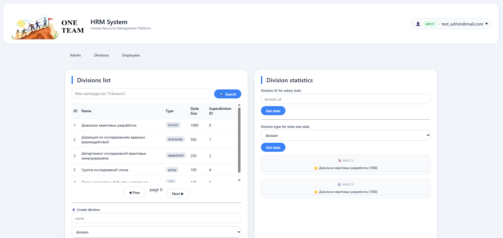
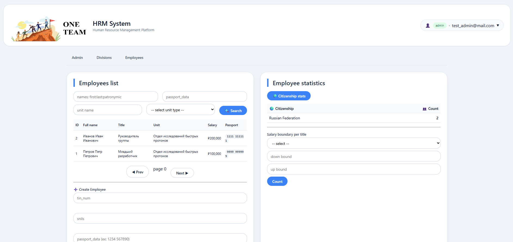
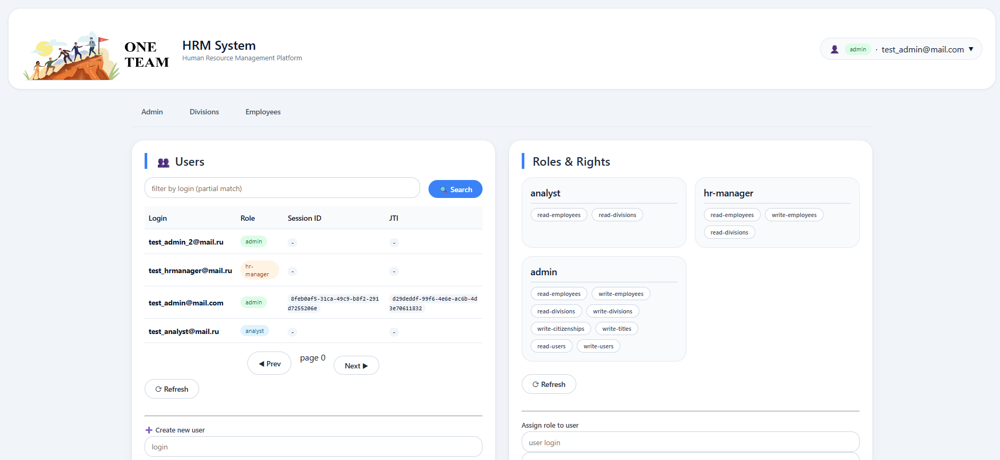

# OneTeam
The simple HR-management system for safe control the employees' personal data

---

## Description
This service may help you to manage the company's employees and divisions.

You may:
- CRUD on employees;
- CRUD on divisions;
- CRUD on users of the service;
- Search the employees, divisions, users;
- Calculate the statistics;
- Manage the user's sessions;
- Assign the user's roles;

### RBAC
The OneTeam uses RBAC-model with 3 roles:
- admin with rights to `CRUD` on employees, divisions, users;
So, just admin can create a new user.

- hr-manager with rights to `CRUD` on employees and `R` on divisions;
- analyst with rights to `R` on employees and divisions;

So, `R` here defines that you may read the info and search the objects using filters.

UI and backend uses the RBAC to confine the interface and backend's functions.

### Statistics
OneTeam helps you to count the statistics among the employees and divisions:
- how many employees of the different citizenships are in the company;
- how many employees with the current salary bound with this title;
- what's the min/avg/max params for the salary in the concrete division;
- what are the divisions of the concrete type have the min/max state size;

### Divisions' taxonomy
The divisions are divided at the most common groups:
1. division
2. directorate
3. department
4. group
5. unit

So, the hierarchy is as on the list (the divisions include the directorates, the directorates include the departments and etc...).
But you can specify the company structure as you want and don't use some of these types.

## How to start?
You can start the service with the docker (make sure that these commands executes **at the project's root**):
Clone the project:
``` bash
git clone https://github.com/MaKcm14/one-team.git
```

Prepare the config.yaml:
``` bash
cp config_example.yaml config.yaml
```
Change the settings to yours.

Start the DB (if you want to use the default deployment):
``` bash
docker compose up db
```
Wait for a minute until let the PostgreSQL start.

Apply migrations. Copy your **DSN** from the config.yaml to the `docker-compose.yaml` in `migrate` service's command to apply the migrations.
``` bash
docker compose up migrate
```

Start the service:
``` bash
docker compose up one-team
```

After that the **OneTeam** service will be available on the **0.0.0.0:8080**.

## How to use?
Open the `/index.html` endpoint in your browser for using the service.

As soon as you start the service at the first time you must to create the **initial-admin** through the `/init` endpoint that will be available just with one call. After that you won't configure the **initial-admin** at all.

## Examples








## How to specify the deploy environment
For safety deploying you have to specify your deploy environment. F.e. the PostgreSQL roles and settings.

See the **docker-compose.yaml** and **Dockerfile** at the project's root to do it.
